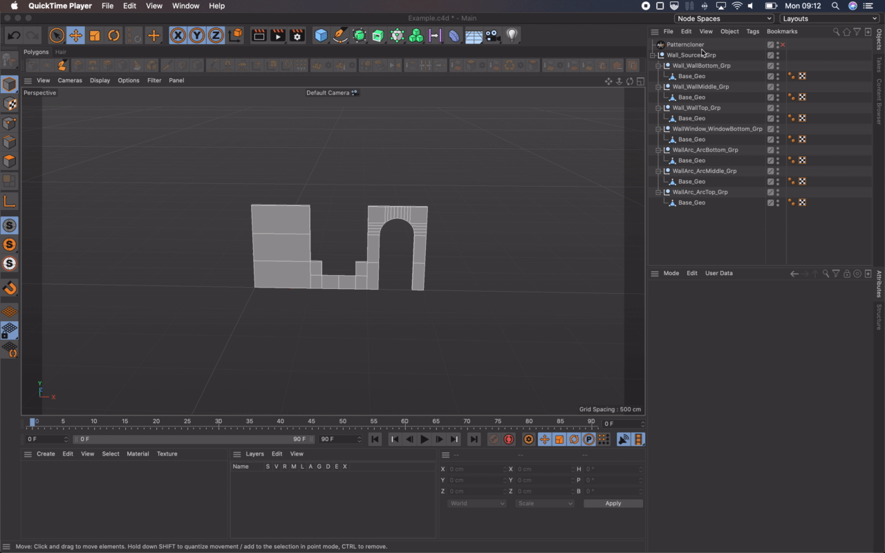

# Patterncloner

Patterncloner is an object plugin for distributing instances in a grid array while following a preset pattern which instance source should be repeated and in which direction.



## Table of Contents

1. [Description](#Description)
    1. [Example](#Example)
1. [Attributes](#Attributes)
    1. [Settings](#Settings-Tab)
    1. [Pattern](#Pattern-Tab)
    1. [Overrides](#Overrides-Tab)
2. [Patterns](#Patterns)

## Description

Patterncloner uses a text representation of a table to describe which element from the child objects of the source Null should be instanced along a grid plane. The number of rows and columns of the grid is derived from the step size and the size. The elements are chosen from the name declared in the pattern and based on the regular expression declared under the **Settings** tab.

The plugin has been build and tested with Cinema 4D R23.008

### Example

Considering the following source Null object setup:

* Sourges_Grp
  * Interior_WallBottom_Grp
  * Interior_WallMiddle_Grp
  * Interior_WallTop_Grp

An **Identifier Pattern** like:

```
_([a-zA-Z]+)_
```

And a pattern like:

```
WallBottom
```

This would repeat the element **Interior_WallBottom_Grp** along the plane axis. If more then one element matches the criteria the element will be randomly selected from those.

## Attributes


### Settings Tab

* **Pattern Delimiter**: Where the pattern should be split on the horizontal axis of the **Pattern** parameter
* **Identifier Pattern**: Regular Expression for detecting the source objects
* **Source**: Link to the Null object containing the objects that should be distributed
* **Step Size**: Distance between objects when distributed

### Pattern Tab

* **Pattern**: The pattern that should be repeated along the plane axis
* **Flip**: Flip pattern horizontally (Left <-> Right)
* **Flop**: Flop pattern vertically (Up <-> Down)
* **Axis**: The plane along which the repetition should appear
* **Seed**: Seed for random selection of source objects
* **Size**: Size of grid array that needs to be filled with source object instances

### Overrides Tab

Use **Add** and **Remove** buttons to create overrides.

* **Object Class**: Name of source object that should be inserted instead
* **Row**: Number of row where the override should be applied
* **Column**: Number of column where the override should be applied

## Patterns

A Patterncloner pattern looks somewhat like this:

```
WallBottom|WindowBottom
WallMiddle|ArcMiddle
WallTop|ArcTop
```

Which will be repeated in a 5 x 5 grid like this since no axis repetition is configured:

| Column 1 | Column 2 | Column 3 | Column 4 | Column 5 |
| --- | --- | --- | --- | --- |
| WallBottom | WindowBottom | WallBottom | WindowBottom | WallBottom |
| WallMiddle | ArcMiddle | WallMiddle | ArcMiddle | WallMiddle |
| WallTop | ArcTop | WallTop | ArcTop | WallTop |
| WallBottom | WindowBottom | WallBottom | WindowBottom | WallBottom |
| WallMiddle | ArcMiddle | WallMiddle | ArcMiddle | WallMiddle |

You can however set up how elements should be repeated per axis. Horizontal repetition is declared by adding an **\*** behind the element name. Vertical repetition is declarerd by adding **:\*** behind the element name. Appending **\*:\*** repeats the element on both axis.

```
WallBottom|WindowBottom
WallMiddle:*|ArcMiddle:*
WallTop|ArcTop
```

Which will be repeated in a 5 x 5 grid like this:

| Column 1 | Column 2 | Column 3 | Column 4 | Column 5 |
| --- | --- | --- | --- | --- |
| WallBottom | WindowBottom | WallBottom | WindowBottom | WallBottom |
| WallMiddle:* | ArcMiddle:* | WallMiddle:* | ArcMiddle:* | WallMiddle:* |
| WallMiddle:* | ArcMiddle:* | WallMiddle:* | ArcMiddle:* | WallMiddle:* |
| WallMiddle:* | ArcMiddle:* | WallMiddle:* | ArcMiddle:* | WallMiddle:* |
| WallTop | ArcTop |  WallTop | ArcTop |  WallTop |